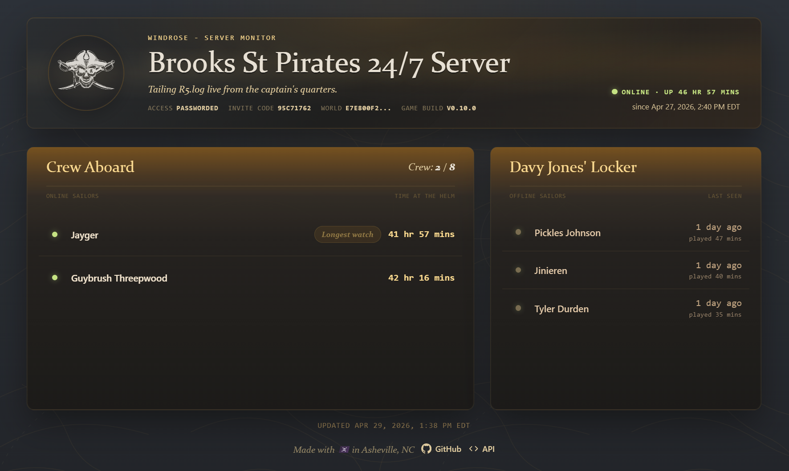

# Windrose Server Monitor

[](https://github.com/paulsena/windrose-server-monitor)

A live player dashboard for your Windrose dedicated server. Drop it on your server machine, point it at `R5.log`, and get a real-time crew roster in your browser — with optional Discord join/leave alerts. Pure Python, no installs required.



---

## Features

- Pirate-themed `index.html` dashboard showing who's online right now
- "Recently seen" list of players who logged off
- Server info: name, player cap, uptime, password status
- Persists recently seen players across monitor restarts
- Optional Discord notifications when players join or leave
- JSON API endpoint for custom integrations
- Pirate-flavored join/leave messages (yarr!)

---

## Requirements

- Python 3.8 or newer
- Access to your Windrose dedicated server's `R5.log` file

That's it. No pip installs needed.

---

## Quick Start

1. **Copy `windrose_monitor.py`, `index.html`, and `assets/`** to the same folder on the machine running your Windrose server (or a machine that can see the log file).

2. **Run it**, pointing it at your log file:

   ```bash
   python windrose_monitor.py --log "C:\path\to\R5.log"
   ```

3. **Open your browser** and go to:

   ```
   http://localhost:8080
   ```

   You'll see the live player dashboard. It fetches `/api/players` automatically every 10 seconds. Others on your network can reach it at your machine's IP address on port 8080.

> **Exposing to the internet:** The easiest way is a [Cloudflare Tunnel](https://developers.cloudflare.com/cloudflare-one/connections/connect-networks/) — no router port forwarding needed. Cloudflare gives you a public HTTPS URL that tunnels straight to your local port 8080. Free to use.

---

## Discord Notifications

Pass your webhook URL directly with `--webhook`:

```bash
python windrose_monitor.py --log "C:\path\to\R5.log" --webhook "https://discord.com/api/webhooks/YOUR/WEBHOOK"
```

Alternatively, set the `DISCORD_WEBHOOK_URL` environment variable and the script will pick it up automatically — useful if you're running it as a background service.

To get a webhook URL: open your Discord server → Edit Channel → Integrations → Webhooks → New Webhook → Copy URL.

---

## All Options

```
python windrose_monitor.py --help
```

| Option | Default | Description |
|---|---|---|
| `--log <path>` | `R5.log` | Path to your Windrose server log file |
| `--host <ip>` | `0.0.0.0` | IP address to listen on (`127.0.0.1` for local-only) |
| `--port <port>` | `8080` | Port for the web dashboard |
| `--state <path>` | `player_state.json` | JSON file used to persist recently seen players |
| `--webhook <url>` | _(none)_ | Discord webhook URL (or set `DISCORD_WEBHOOK_URL` env var) |
| `-v` / `--verbose` | off | Enable detailed debug logging |

---

## API Endpoint

The monitor also serves a JSON API at `/api/players`. Public player rows include display-friendly fields such as name, state, play time, and last-seen timestamps. Private identifiers such as account IDs and session IDs are intentionally omitted.

```
http://127.0.0.1:8080/api/players
```

Response example:
```json
{
  "online_count": 2,
  "online": [
    {
      "name": "PlayerOne",
      "state": "Connected",
      "time_in_game": "+00:42:00.000",
      "joined_at": "2026-04-29T11:15:00+00:00"
    }
  ],
  "recently_seen": [
    {
      "name": "PlayerTwo",
      "state": "Disconnected",
      "left_at": "2026-04-29T12:00:00+00:00"
    }
  ],
  "as_of": "2026-04-29T12:05:00+00:00",
  "server_started_at": "2026-04-29T10:00:00+00:00",
  "server_info": {
    "server_name": "My Windrose Server",
    "max_players": 10,
    "password_protected": false,
    "invite_code": "95c71762",
    "world_id": "example-world-id",
    "deployment_id": "release-1.2.3"
  }
}
```

---

## Running as a Background Service

Keep `index.html` and `assets/` in the same directory as `windrose_monitor.py`. For scheduled/background runs, pass an explicit `--state` path so recently seen players are saved somewhere predictable.

### Windows — Task Scheduler

1. Open **Task Scheduler** → Create Basic Task
2. Set trigger to "When the computer starts"
3. Action: Start a program → `python.exe`, arguments: `C:\path\to\windrose_monitor.py --log "C:\path\to\R5.log" --host 0.0.0.0 --state "C:\path\to\player_state.json"`
4. Check "Run whether user is logged on or not"

### Linux — systemd

Create `/etc/systemd/system/windrose-monitor.service`:

```ini
[Unit]
Description=Windrose Server Player Monitor
After=network.target

[Service]
WorkingDirectory=/opt/windrose
ExecStart=/usr/bin/python3 /opt/windrose/windrose_monitor.py --log /path/to/R5.log --host 0.0.0.0 --state /opt/windrose/player_state.json
Environment=DISCORD_WEBHOOK_URL=https://discord.com/api/webhooks/YOUR/WEBHOOK
Restart=always

[Install]
WantedBy=multi-user.target
```

Then:
```bash
sudo systemctl enable windrose-monitor
sudo systemctl start windrose-monitor
```

---

## Troubleshooting

**The dashboard is empty / shows no players**
- Make sure `--log` points to the correct `R5.log` file.
- The monitor reads from the last player dump in the log on startup. If the server just started, wait a minute for the first dump to appear.

**Recently seen players disappeared**
- By default, the monitor writes recently seen players to `player_state.json` in the current working directory.
- Use `--state "C:\path\to\player_state.json"` if you run the monitor from a scheduled task or service and want a predictable state-file location.

**Discord notifications aren't arriving**
- Double-check your webhook URL is correct.
- Check the terminal output for any warning messages about the webhook.

**I can't access the dashboard from another computer**
- Make sure your firewall allows inbound traffic on port `8080`.
- For internet access without touching your router, use a [Cloudflare Tunnel](https://developers.cloudflare.com/cloudflare-one/connections/connect-networks/) — it's free and takes about 5 minutes to set up.
- Use `--host 127.0.0.1` if you want to restrict access to the local machine only.

---

## How It Works

Windrose's dedicated server writes periodic player state dumps to `R5.log`. The monitor tails this file, parses the `Connected Accounts` / `Reserved Accounts` / `Disconnected Accounts` sections, and maintains a live roster. When the script starts, it fast-seeks to the most recent dump so startup is instant even on large log files. Recently seen players are also loaded from the state file and updated whenever new disconnect information is parsed.

---

## License

MIT — do whatever you like with it.
